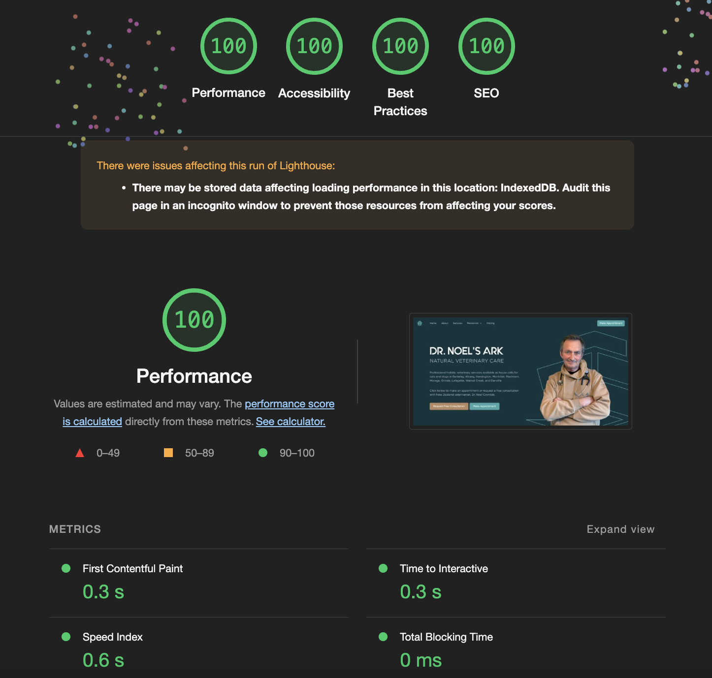

## Overview

This is a [Next.js](https://nextjs.org/) project bootstrapped with [create-next-app](https://github.com/vercel/next.js/tree/canary/packages/create-next-app) and written in [Typescript](https://www.typescriptlang.org/).

My goal with this project was to help my father's veterinary company attract new clients.
To achieve this, I developed a distinct, functional, and eye-catching website that allows visitors to learn about his experience and the range of services he offers before easily registering for appointments. When visitors sign up, they trigger an email notification, and their information is displayed in a private admin portal. This portal shows their contact information, location, and their pet's problems, making it easy to follow up with them and grow the business.

## Technical Features

The website includes a range of features such as user authorization, sign up forms, an admin portal, page routing, scroll animations, and a fully responsive UI. Additionally, the site is built with accessibility, SEO, and performance in mind, achieving a perfect 100 in all Chrome Lighthouse sections.

## View website

You can view the live website at [drnoelsark.com](https://www.drnoelsark.com)!